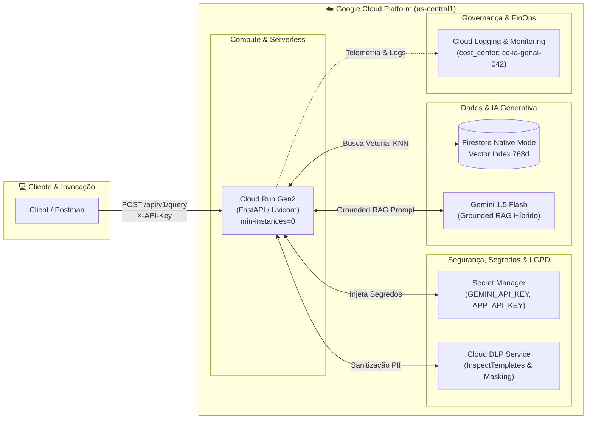
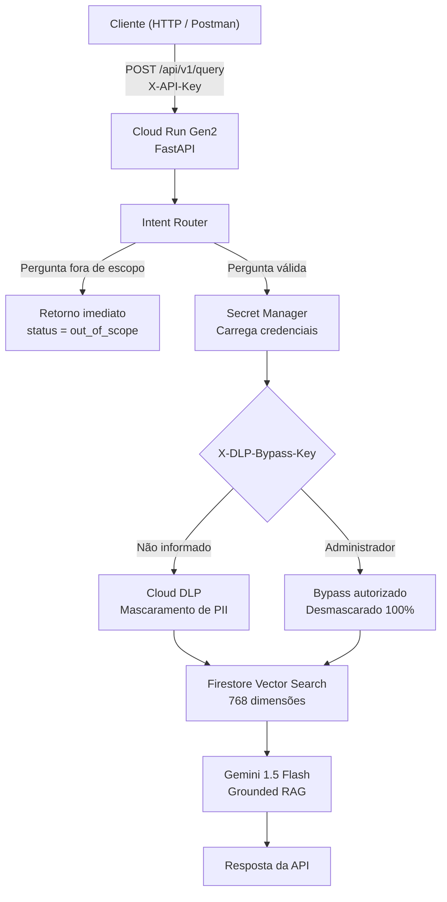

# 🛡️ Arquitetura RAG Segura na Google Cloud: combinando IA Generativa (Gemini 1.5), Cloud DLP, Secret Manager, Terraform e FinOps com custo zero em produção

A Inteligência Artificial Generativa vem transformando a forma como empresas acessam conhecimento interno. Entretanto, colocar uma solução de **Retrieval-Augmented Generation (RAG)** em produção envolve desafios que vão muito além da escolha do modelo de linguagem.

Como proteger dados sensíveis? Como atender aos requisitos da LGPD? Como evitar custos desnecessários? E como garantir que toda a infraestrutura seja reproduzível e escalável?

Neste artigo apresento a arquitetura do projeto **RAG Seguro GCP**, desenvolvido para responder a esses desafios utilizando serviços gerenciados da Google Cloud Platform.

---

# 📌 O desafio: IA corporativa versus privacidade

Empresas desejam permitir que colaboradores consultem documentos internos utilizando linguagem natural através de Large Language Models (LLMs).

Entretanto, essa abordagem apresenta dois desafios críticos.

## 🔒 Proteção de Dados (LGPD)

Informações sensíveis como:
* CPF / SSN
* Nome completo civil
* Endereços e bases
* Coordenadas geográficas (GPS)
* Registros financeiros e contratuais

não podem ser expostas para usuários não autorizados nem utilizadas indiscriminadamente pelos modelos de IA.

---

## 💰 Controle de custos (FinOps)

Outro desafio está relacionado ao custo operacional.

Perguntas fora do domínio da aplicação continuam consumindo:
* consultas ao banco vetorial;
* chamadas ao Cloud DLP;
* processamento do LLM;
* tokens.

Em ambientes corporativos isso representa desperdício financeiro significativo.

---

# 🏛️ A solução: Projeto RAG Seguro GCP

Para resolver esses desafios desenvolvi uma API **Serverless** baseada em **FastAPI**, seguindo os princípios de:
* Clean Architecture
* Domain-Driven Design (DDD)
* Test-Driven Development (TDD)

A solução utiliza serviços totalmente gerenciados da Google Cloud:
* **Cloud Run Gen2**
* **Google Cloud Secret Manager**
* **Google Cloud DLP**
* **Firestore Native Vector Search (768d)**
* **Gemini 1.5 Flash (Top-P=0.95, Temp=0.2)**
* **Cloud Logging & Monitoring**

O objetivo foi construir uma arquitetura preparada para produção, priorizando segurança, escalabilidade, observabilidade e otimização de custos.

---

# 📐 Arquitetura dos Serviços na Google Cloud Platform

Para proporcionar uma visão completa da solução, o projeto combina a **arquitetura física dos serviços gerenciados da GCP** com o **fluxo lógico da requisição**.

### ☁️ 1. Diagrama de Arquitetura de Serviços GCP



---

### 🔄 2. Fluxo Lógico da Requisição



---

# ☁️ Cloud Run Gen2: execução da API

Toda a API é executada no **Google Cloud Run Gen2**, permitindo uma arquitetura totalmente serverless.

Entre os principais benefícios:
* Deploy via container Docker
* Escalabilidade automática
* Alta disponibilidade
* Scale-to-Zero (`min-instances=0`)
* Integração nativa com IAM e Secret Manager
* Cloud Logging & Cloud Monitoring

A aplicação permanece desligada quando não há requisições, eliminando custos de infraestrutura ociosa.

📸 **PRINT 1:** Console do Cloud Run mostrando o serviço implantado, a tag FinOps `cost_center = "cc-ia-genai-042"` e o Scale-to-Zero (`min-instances=0`).

---

# 🔐 Gerenciamento seguro de credenciais

Uma prática essencial em ambientes corporativos é nunca armazenar credenciais diretamente no código ou em arquivos `.env`.

Todas as chaves utilizadas pela aplicação são armazenadas no **Google Cloud Secret Manager**.

Entre elas:
* `GEMINI_API_KEY`
* `APP_API_KEY`
* `APP_BYPASS_KEY`

Durante o deploy, o Cloud Run injeta automaticamente esses segredos como variáveis de ambiente no container.

Essa abordagem oferece:
* Criptografia gerenciada;
* Controle de acesso via IAM;
* Rotação simplificada das chaves;
* Auditoria completa de acesso.

📸 **PRINT 2:** Console do Secret Manager exibindo os segredos do projeto.

---

# 🛡️ Proteção de dados com Cloud DLP

Após validar a requisição, a aplicação verifica se o usuário possui permissão para visualizar dados sensíveis.

Existem dois modos de operação:

## Usuário padrão (LGPD Masking)

O texto é processado pelo **Google Cloud DLP**, mascarando automaticamente:
* Nomes reais;
* CPF / SSN;
* Coordenadas geográficas;
* Registros contratuais e PII.

Exemplo:
```text
Peter Benjamin Parker

↓

[DADO_CONFIDENCIAL]
```

---

## Administrador (Auditoria Privilegiada)

Usuários autorizados podem utilizar o cabeçalho:
```text
X-DLP-Bypass-Key: rag-admin-bypass-2026
```

Nesse modo, a resposta retorna 100% desmascarada para fins de auditoria, junto com a lista de PIIs brutas autorizadas no metadado.

📸 **PRINT 3:** Comparação entre a resposta do modo padrão (sanitizada) e do modo administrador (desmascarada).

---

# 🔍 Busca vetorial e Grounded RAG

Após a sanitização, inicia-se o processo de Retrieval-Augmented Generation.

## Firestore Vector Search

Os documentos são indexados utilizando embeddings de **768 dimensões**, permitindo busca semântica baseada em similaridade por cosseno ($KNN$).

---

## Gemini 1.5 Flash (RAG Híbrido)

O Gemini recebe a pergunta do usuário e os documentos recuperados pelo Firestore como ancoragem de verdade.

Se a pergunta for sobre relacionamentos, familiares ou detalhes do universo do herói citado na ficha (ex: *"qual o nome dos avós do Homem-Aranha?"*), o modelo responde sintetizando o conhecimento grounded no catálogo.

---

# ⚙️ Infraestrutura como Código (Terraform)

Toda a infraestrutura foi provisionada utilizando **Terraform (>= 1.5.0)**.

Estrutura exata do projeto no repositório:

```text
terraform/
├── main.tf         # Cloud Run Gen2, Service Accounts, IAM & Secret Manager
├── dlp.tf          # Cloud DLP InspectTemplates (PERSON_NAME, SSN, GPS, Location)
├── firestore.tf    # Database Firestore Native & Vector Index 768d (Cosine)
└── variables.tf    # Project ID, Region, Cost Center Tag (cc-ia-genai-042)
```

Os principais recursos provisionados incluem:

## Cloud Run
* Serviço serverless Gen2;
* Scale-to-Zero (`min-instances=0`);
* Injeção de variáveis e segredos do Secret Manager;
* Service Account dedicada com IAM Least Privilege.

## Cloud DLP
* Templates de inspeção e mascaramento determinístico/estatístico.

## Firestore
* Modo Nativo com Índice Vetorial Composto de **768 dimensões**.

---

# 🧪 Qualidade com TDD (Pytest)

A solução foi desenvolvida utilizando **Test-Driven Development**.

A suíte automatizada valida:
* Contratos da API FastAPI;
* Autenticação via `X-API-Key`;
* Intent Router (Pre-Query Guardrail);
* Cloud DLP & LocalPIIRules;
* Busca vetorial;
* RAG Híbrido com o Gemini Flash;
* Suporte ao desmascaramento Admin (`X-DLP-Bypass-Key`).

Resultado: **13 de 13 testes aprovados (100%).**

📸 **PRINT 4:** Execução do `pytest` no terminal com 13 testes 100% aprovados.

---

# 🏢 Evolução para ambientes Enterprise

| Camada | POC | Enterprise (Produção Scale) |
| :--- | :--- | :--- |
| **Infraestrutura** | Terraform Local | **Terraform Cloud / Atlantis** + Remote State no **GCS Bucket** com Lock |
| **Deploy & CI/CD** | `gcloud run deploy` | **GitHub Actions / Cloud Build Triggers** + Container Registry |
| **Segredos** | Secret Manager | **Secret Manager** + CMEK (Customer-Managed Encryption Keys) |
| **Busca Vetorial** | Firestore Vector Index | **Vertex AI Vector Search** ou **AlloyDB (pgvector)** + Cohere Re-Ranker |
| **IA Generativa** | Gemini 1.5 Flash | **Vertex AI Gemini API** + **Google ADK (Agent Development Kit)** |
| **Observabilidade**| Cloud Logging | **Cloud Logging + Cloud Trace + BigQuery Agent Analytics** |
| **Avaliação** | Pytest | Framework **RAGAS / TruLens** na esteira CI/CD |

---

# 💡 Casos de uso

## 🏥 Saúde & Telemedicina
Consulta segura de prontuários médicos com anonimização automática de dados sensíveis antes do envio à LLM.

---

## 🏦 Mercado Financeiro & Bancário
Análise de fraudes e contestações preservando dados confidenciais de cartões e contas dos clientes.

---

## ⚖️ Jurídico & Compliance
Busca semântica em contratos e processos judiciais com acesso desmascarado exclusivo para auditores credenciados.

---

# 💰 FinOps na prática

Além da segurança, a arquitetura foi projetada para otimização máxima de custos.

## Scale-to-Zero
O Cloud Run permanece desligado quando não existem requisições.  
Custo de infraestrutura ociosa: **US$ 0,00**.

---

## Intent Router
Perguntas fora do domínio são bloqueadas antes de consumir recursos.  
Isso significa:
* **0 consultas ao Firestore**
* **0 chamadas ao Cloud DLP**
* **0 consumo de tokens do Gemini**

---

## Tag de Centro de Custo
Todos os recursos provisionados via Terraform recebem a tag:
```text
cost_center = "cc-ia-genai-042"
```
permitindo rastreamento detalhado dos custos no Google Cloud Billing.

📸 **PRINT 5:** Resposta do terminal cURL ou Postman demonstrando o bloqueio de escopo da pergunta *"Quem é o presidente do Brasil ?"*.

---

# 🚀 Conclusão

Projetos de IA Generativa em produção exigem muito mais do que integrar um modelo de linguagem. É necessário construir uma arquitetura capaz de equilibrar quatro pilares fundamentais:
* 🔒 **Segurança**
* 📜 **Conformidade com a LGPD**
* ☁️ **Escalabilidade**
* 💰 **Eficiência financeira (FinOps)**

O projeto **RAG Seguro GCP** demonstra como combinar **Cloud Run**, **Secret Manager**, **Cloud DLP**, **Firestore Vector Search**, **Gemini 1.5 Flash** e **Terraform** para construir uma solução moderna, segura e preparada para ambientes corporativos.

Mais do que uma prova de conceito, essa arquitetura estabelece uma base sólida para evolução rumo a um ambiente Enterprise, mantendo governança, observabilidade, segurança e otimização de custos desde o primeiro dia.

---

## 🛠️ Tecnologias utilizadas

* Google Cloud Platform (GCP)
* Cloud Run Gen2
* FastAPI
* Gemini 1.5 Flash
* Firestore Native Vector Search (768d)
* Google Cloud Secret Manager
* Google Cloud DLP
* Terraform
* Pytest
* Docker
* Clean Architecture
* Domain-Driven Design (DDD)
* Test-Driven Development (TDD)
* FinOps (`cost_center = "cc-ia-genai-042"`)

---

## 👨‍💻 Autor

**Rafael da Silva Siqueira**

🔗 GitHub do Projeto: [https://github.com/RafaeldsSiqueira/GCP-Rag-Seguro](https://github.com/RafaeldsSiqueira/GCP-Rag-Seguro)
