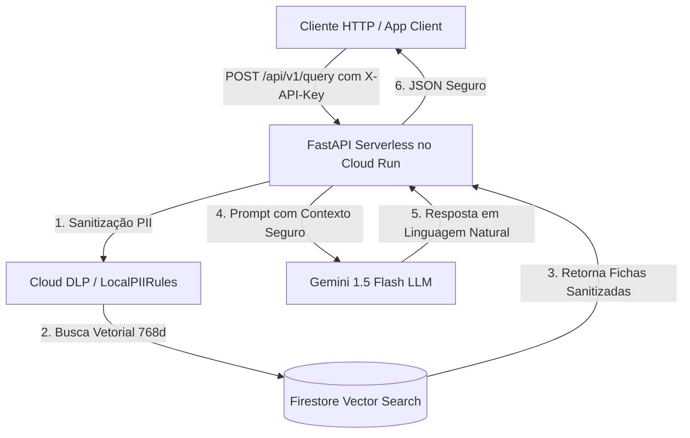

# 🛡️ RAG Seguro GCP: Pipeline de IA Generativa com Sanitização DLP, Firestore Vector Search e FinOps


> **API Serverless de Busca Semântica (RAG) com mascaramento determinístico e estatístico de dados sensíveis (PII/SSN/Geolocalização) via Google Cloud DLP antes do envio ao Gemini 1.5 Flash.**

---

## 📌 Visão Geral e Arquitetura

O **RAG Seguro GCP** foi desenvolvido seguindo os princípios de **Clean Architecture (DDD)**, **TDD (Test-Driven Development)**, **IAM Least Privilege** e **FinOps (Custo Zero com Scale-to-Zero)**.

### 🔄 Fluxo de Dados End-to-End



---

## 🚀 Recursos e Funcionalidades

- 🛡️ **Sanitização de PIIs:** Intercepta e mascara nomes reais, localizações de bases, coordenadas GPS, SSNs/CPFs e contas bancárias.
- 🗄️ **Base de Dados Exemplo:** 130 Heróis (65 DC Comics + 65 Marvel Comics) com dados sigilosos simulados para testes de estresse.
- 🔍 **Busca Vetorial por Similaridade:** Embeddings de 768 dimensões com distância de Cosseno no **Firestore Native Mode**.
- 🤖 **Integração com Gemini 1.5 Flash:** Respostas geradas de forma segura com prompt customizado e rodapé de governança FinOps.
- 🔐 **Autenticação por X-API-Key:** Endpoints protegidos com middleware de segurança HTTP.
- 💰 **Garantia de Custo Zero (FinOps):** Deploy configurado com `--min-instances=0` (*Scale to Zero*) e tag `cost_center = "cc-ia-genai-042"`.
- ⚙️ **Infraestrutura como Código (IaC):** Provisionamento idêntico via Terraform.

---

## 🛠️ Tecnologias Utilizadas

- **Linguagem:** Python 3.12+
- **Framework API:** FastAPI / Uvicorn
- **Provedor Cloud:** Google Cloud Platform (GCP)
- **Serviços GCP:** Cloud Run Gen 2, Cloud DLP, Cloud Firestore Native, Secret Manager, Cloud Build
- **Modelo de IA:** Gemini 1.5 Flash (Google AI Studio / Vertex AI)
- **Infraestrutura como Código:** Terraform >= 1.5.0
- **Suíte de Testes:** Pytest, Pytest-Cov (11 testes automatizados passing)

---

## 📋 Endpoints da API HTTP

### URL de Produção no Cloud Run:
`https://api-rag-seguro-3jjpib7fzq-uc.a.run.app`

| Método | Endpoint | Autenticação | Descrição |
| :--- | :--- | :--- | :--- |
| `GET` | `/healthz` | Nenhuma | Health Check do serviço e tag FinOps |
| `POST` | `/api/v1/ingest` | `X-API-Key` | Sanitiza texto bruto via DLP e salva no Firestore Vector |
| `POST` | `/api/v1/query` | `X-API-Key` | Realiza a busca vetorial RAG e gera resposta via Gemini |

---

## 💻 Exemplo de Requisição (curl)

### 1. Ingestão de Documento (`/api/v1/ingest`)
```bash
curl -X POST https://api-rag-seguro-3jjpib7fzq-uc.a.run.app/api/v1/ingest \
  -H "Content-Type: application/json" \
  -H "X-API-Key: rag-secret-key-2026" \
  -d '{
    "documento_id": "dc-001",
    "titulo": "Ficha Batman",
    "conteudo_bruto": "Bruce Wayne mora em Gotham City e sua base e a Batcaverna. SSN: 101-99-4001"
  }'
```

### 2. Consulta RAG (`/api/v1/query`)
```bash
curl -X POST https://api-rag-seguro-3jjpib7fzq-uc.a.run.app/api/v1/query \
  -H "Content-Type: application/json" \
  -H "X-API-Key: rag-secret-key-2026" \
  -d '{
    "pergunta": "Onde fica a base do Batman?",
    "top_k": 1
  }'
```

---

## 🧪 Executando os Testes Automatizados Localmente

```bash
# 1. Ativar o ambiente virtual
source venv/bin/activate

# 2. Executar a suíte de testes com cobertura
PYTHONPATH=. pytest --cov=src tests/ -v
```

---

## 🛡️ Governança & FinOps

- **Cost Center Tag:** `cc-ia-genai-042`
- **Ambiente:** `poc`
- **Dono:** `rafael-siqueira`
- **Política de Custos:** Scale-to-Zero (`min-instances=0`) no Cloud Run + Always Free Tier no Firestore e Cloud DLP.

---

**Autor / Generative AI Leader:** Rafael da Silva Siqueira
