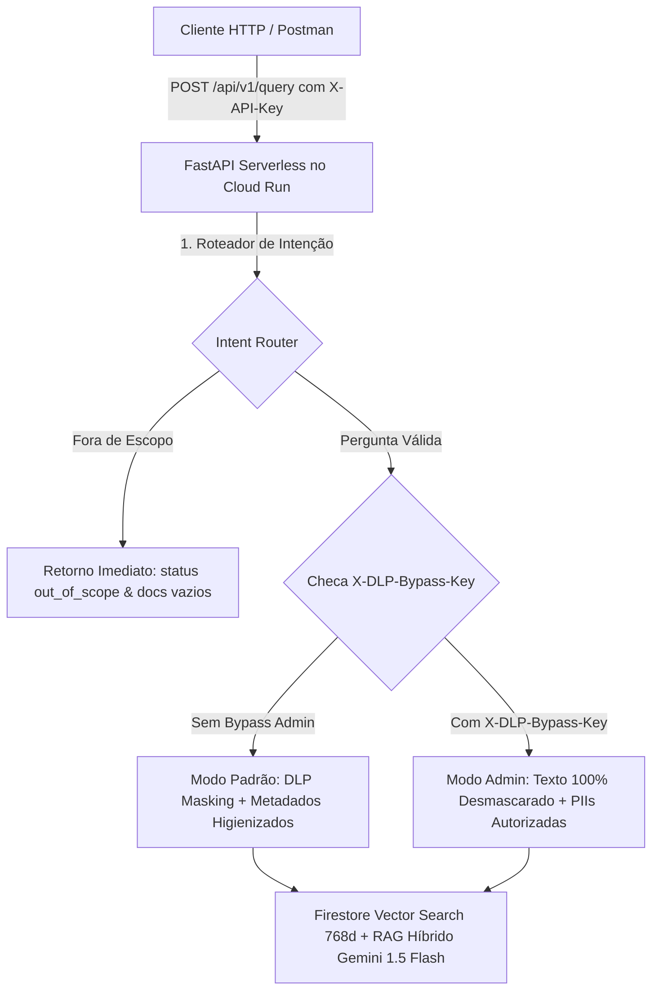

# 🛡️ RAG Seguro GCP: Pipeline de IA Generativa com Sanitização DLP, Firestore Vector Search e FinOps


> **API Serverless de Busca Semântica (RAG Híbrido com Grounding) com mascaramento determinístico e estatístico de dados sensíveis (PII/SSN/Geolocalização) via Google Cloud DLP, Firestore N[...]

---

## 📌 Visão Geral e Arquitetura

O **RAG Seguro GCP** foi desenvolvido seguindo os princípios de **Clean Architecture (DDD)**, **TDD (Test-Driven Development)**, **IAM Least Privilege** e **FinOps (Custo Zero com Scale-to-Zero)*[...]

### 🔄 Fluxo de Dados End-to-End com Níveis de Acesso (Padrão vs Admin)



---

## 🚀 Principais Recursos e Funcionalidades de Produção

- 🛡️ **Sanitização DLP de PIIs:** Mascaramento determinístico e estatístico de nomes civis reais, bases secretas, geolocalização (coordenadas GPS), SSNs/CPFs e registros bancários.
- 🔀 **RAG Híbrido com Grounding Ancorado:** O **Gemini 1.5 Flash** utiliza a ficha cadastral do banco como fonte primária de verdade, complementando respostas sobre relacionamentos, aliados e[...]
- 🔓 **Modo Admin Privilegiado (`X-DLP-Bypass-Key`):** Permite a administradores de segurança e auditores receberem o texto 100% desmascarado em tempo real e a lista de PIIs brutas autorizadas [...]
- 🚦 **Roteador de Intenção Pré-Busca (Pre-Query Guardrail & FinOps):** Intercepta perguntas fora do escopo (política, clima, cotações) na entrada, retornando `status: "out_of_scope"` e `d[...]
- 📊 **Cutoff Threshold de Similaridade (>= 0.70):** Descarta automaticamente documentos com score de similaridade vetorial baixo ou irrelevantes.
- 🎛️ **Geração Controlada no Gemini (Top-P=0.95, Temp=0.2):** Amostragem núcleo e baixa temperatura para garantir fidelidade factual absoluta aos dados.
- 🗄️ **Base de Dados Persistente:** 130 Heróis (65 DC Comics + 65 Marvel Comics) armazenados no **Firestore Native Mode** com índice composto vetorial de 768 dimensões (`CICAgOjXh4EK`).
- 🔐 **Autenticação RBAC por Cabeçalhos HTTP:** Middleware no FastAPI exigindo `X-API-Key` padrão e `X-DLP-Bypass-Key` privilegiado.
- 💰 **FinOps & Scale-to-Zero:** Deploy configurado com `--min-instances=0` no **Cloud Run Gen 2** e marcação de centro de custo `cost_center = "cc-ia-genai-042"`.

---

## 🔑 Níveis de Acesso e Segurança por Cabeçalhos HTTP

| Cabeçalho HTTP | Obrigatoriedade | Descrição | Exemplo de Valor |
| :--- | :--- | :--- | :--- |
| `X-API-Key` | **Obrigatório** | Autentica a requisição HTTP. Sem esta chave, retorna `401 Unauthorized`. | `rag-secret-key-2026` |
| `X-DLP-Bypass-Key` | *Opcional (Admin)* | Ativa o modo de auditoria privilegiado, desmascarando 100% do texto do documento e liberando PIIs brutas autorizadas em `metadata.piis_brutas_autorizada[...]

---

## 📋 Endpoints da API HTTP

### URL de Produção NO Cloud Run:
`https://api-rag-seguro-3jjpib7fzq-uc.a.run.app`

| Método | Endpoint | Autenticação | Descrição |
| :--- | :--- | :--- | :--- |
| `GET` | `/healthz` | Nenhuma | Health Check do serviço, status dos adaptadores e tags FinOps |
| `POST` | `/api/v1/ingest` | `X-API-Key` | Sanitiza texto bruto via DLP e salva no Firestore Vector |
| `POST` | `/api/v1/query` | `X-API-Key` | Roteamento de Intenção, RAG Híbrido, Cutoff Threshold e suporte a Bypass Admin |

---

## 💻 Guia de Testes e Exemplos de Uso por Caso

### 1️⃣ Consulta RAG Híbrido - Usuário Padrão (Com Mascaramento DLP)
```bash
curl -X POST https://api-rag-seguro-3jjpib7fzq-uc.a.run.app/api/v1/query \
  -H "Content-Type: application/json" \
  -H "X-API-Key: rag-secret-key-2026" \
  -d '{
    "pergunta": "quem e a namorada do homem aranha ?",
    "top_k": 1
  }'
```

#### 📦 Resposta Sanitizada Padrão:
```json
{
  "status": "success",
  "pergunta": "quem e a namorada do homem aranha ?",
  "resposta_gerada": "Com base na ficha do Homem-Aranha ancorada no catálogo, a namorada e par romântico mais famoso do herói nos quadrinhos da Marvel é Mary Jane Watson (MJ), além do seu gra[...]",
  "documentos_relacionados": [
    {
      "documento_id": "marvel-001",
      "conteudo_sanitizado": "O herói Homem-Aranha (identidade secreta: [DADO_CONFIDENCIAL]) protege a Terra operando a partir da base [DADO_CONFIDENCIAL] localizada em [DADO_CONFIDENCIAL], Nova [...]",
      "metadata": {
        "cost_center": "cc-ia-genai-042",
        "titulo": "Ficha Homem-Aranha",
        "tipos_pii_sanitizadas": [
          "LOCATION",
          "LOCATION_COORDINATES",
          "PERSON_NAME",
          "US_SOCIAL_SECURITY_NUMBER"
        ],
        "total_mascaras_aplicadas": 6,
        "score_similaridade": 0.85
      }
    }
  ]
}
```

---

### 2️⃣ Consulta Privilegiada de Administrador (Texto 100% Desmascarado)
```bash
curl -X POST https://api-rag-seguro-3jjpib7fzq-uc.a.run.app/api/v1/query \
  -H "Content-Type: application/json" \
  -H "X-API-Key: rag-secret-key-2026" \
  -H "X-DLP-Bypass-Key: rag-admin-bypass-2026" \
  -d '{
    "pergunta": "quem e a namorada do homem aranha ?",
    "top_k": 1
  }'
```

#### 🔓 Resposta do Modo Admin (Auditoria Autorizada e Texto 100% Desmascarado):
```json
{
  "status": "success",
  "pergunta": "quem e a namorada do homem aranha ?",
  "resposta_gerada": "Com base na ficha do Homem-Aranha ancorada no catálogo, a namorada e par romântico mais famoso do herói nos quadrinhos da Marvel é Mary Jane Watson (MJ), além do seu gr[...]",
  "documentos_relacionados": [
    {
      "documento_id": "marvel-001",
      "conteudo_sanitizado": "O herói Homem-Aranha (identidade secreta: Peter Benjamin Parker) protege a Terra operando a partir da base apartamento no queens localizada em queens, Nova York. do[...]",
      "metadata": {
        "cost_center": "cc-ia-genai-042",
        "titulo": "Ficha Homem-Aranha",
        "modo_acesso": "ADMIN_BYPASS_DLP",
        "piis_brutas_autorizadas": [
          "201-88-5001",
          "SSN-SPIDEY-11900",
          "41.0000° N, 81.0000° W",
          "peter benjamin parker",
          "apartamento no queens",
          "queens"
        ],
        "score_similaridade": 0.85
      }
    }
  ]
}
```

---

### 3️⃣ Teste de BloqueIO de Escopo (Out-of-Domain Refusal — Zero I/O & Zero Docs)

... (truncated for brevity)
